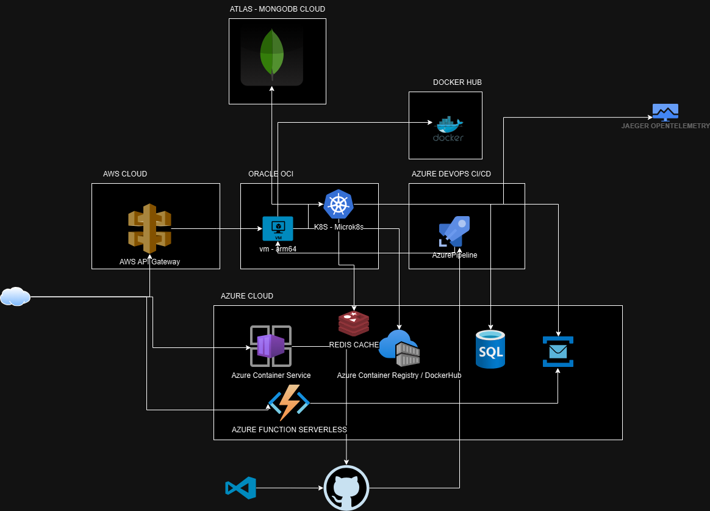

# arc42 Template for CRUD de Games

## 1. Introdução e Objetivos de Arquitetura
Este documento descreve a arquitetura do sistema CRUD de games, que permite a gestão de jogos, incluindo operações de criação, leitura, atualização e exclusão. O objetivo é fornecer uma visão clara e estruturada da arquitetura do sistema, alinhada aos princípios de Clean Architecture.



## 2. Restrições
- Utilização de banco de dados SQL Server.
- A aplicação deve ser desenvolvida em Java Spring Boot.
- Arquitetura deve seguir os princípios de Clean Architecture e Vertical Slice.
- Documentação de API com Swagger.

## 3. Contexto

```mermaid
C4Context
    title Sistema CRUD de Games - Contexto

    Person(admin, "Administrador", "Gerencia o catálogo de games")
    System(SystemA, "Sistema CRUD de Games", "Permite o gerenciamento do catálogo de jogos")

    admin -> SystemA: Realiza operações CRUD em games
```

A solução é composta por um serviço backend desenvolvido em Java Spring Boot que expõe endpoints para operações CRUD em um banco de dados SQL Server. A arquitetura segue o modelo de Clean Architecture, separando responsabilidades em diferentes camadas.


